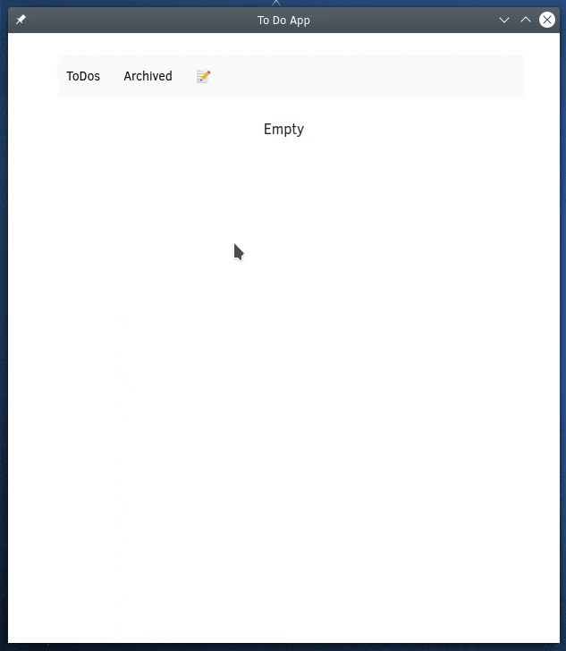

# TODO REACT TYPESCRIPT



## belaj

```
const handleUpdateToDo = async (e: any) => {
    e.preventDefault();
    if (!toDoForm.title) {
      setErrorMsg({ ...errorMsg, error: true });
      return;
    }
    try {
      if (toDoForm.desc !== "") {
        const response = await todoService.updateTodo(todoId, {
          title: toDoForm.title,
          desc: toDoForm.desc,
        });
        todosContext?.todos?.forEach((todo) => {      // menjam state iz konteksta 
          if (todo._id === response.data._id) {       // jer mi je tako lakse
            todo.title = response.data.title;
            todo.updatedAt = response.data.updatedAt;       // bilo mi zajebano zameniti objekat
            if (response?.data.desc !== null) {             // a da pritom zadrzi isti redosled
              todo.desc = response.data.desc;               // jbg
            }
          }
        });
      } else {
        const response = await todoService.updateTodo(todoId, {
          title: toDoForm.title,
        });
        todosContext?.todos?.forEach((todo) => {
          if (todo._id === response.data._id) {
            todo.title = response.data.title;
            todo.updatedAt = response.data.updatedAt;
          }
        });
      }
      todosContext?.setShowEditForm({
        todoId: "",
        show: false,
      });
      setToDoForm({
        title: "",
        desc: "",
        showDesc: false,
      });
    } catch (e) {
      console.log(e);
    }
  };
```
